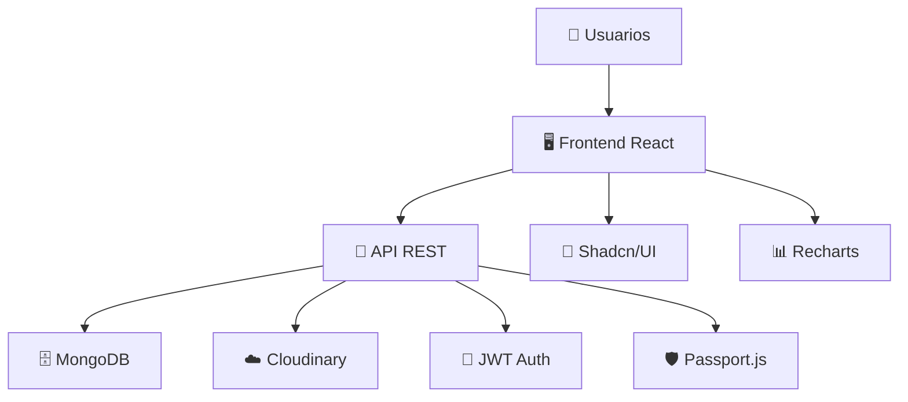

# 🛒 Plug n POS - Sistema de Punto de Venta

> **Sistema de punto de venta moderno y ligero diseñado para pequeños negocios que no emplean códigos de barras**

Un sistema POS completo desarrollado con tecnologías modernas, optimizado para panaderías, cafeterías, negocios de alimentos y cualquier comercio que requiera un sistema de ventas intuitivo y eficiente.

## 🌟 Características Destacadas

### 🚀 **Tecnología Moderna**
- **Frontend**: React 19 + Vite + Tailwind CSS
- **Backend**: Node.js + Express + MongoDB
- **Arquitectura**: API REST con autenticación JWT
- **UI/UX**: Componentes Shadcn/UI con diseño responsivo

### 🔐 **Autenticación Completa**
- Login tradicional con email y contraseña
- Integración con Google OAuth 2.0
- Sistema de refresh tokens para mayor seguridad
- Roles diferenciados (Propietario/Empleado)

### 💼 **Gestión Empresarial**
- Dashboard con métricas y analytics del negocio
- Control de inventario inteligente
- Gestión de empleados con códigos de invitación
- Configuración personalizable del negocio

### 🛍️ **Sistema de Ventas**
- Interfaz de venta intuitiva y rápida
- Carrito de compras con cálculo automático
- Procesamiento de pagos con cálculo de cambio
- Historial completo de órdenes

### 📊 **Analytics y Reportes**
- Gráficos interactivos con Recharts
- Métricas en tiempo real
- Control de jornadas laborales
- Reportes de ventas detallados

## 🏗️ Arquitectura del Sistema



## 📦 Repositorios del Proyecto

### 🖥️ [Frontend - React Application](https://github.com/lalo2911/plug-n-pos-frontend)
**Interfaz de usuario moderna y responsiva**

- ⚡ React 19 + Vite para máximo rendimiento
- 🎨 Tailwind CSS + Shadcn/UI para diseño elegante
- 📱 Totalmente responsiva (Mobile-first)
- 🔄 React Query para gestión de estado del servidor
- 📝 Formularios con React Hook Form + Zod

**Características Principales:**
- Dashboard analítico para propietarios
- Punto de venta optimizado para empleados
- Autenticación con Google OAuth
- Gestión de productos y categorías
- Carrito de compras inteligente

### 🔧 [Backend - Node.js API](https://github.com/lalo2911/plug-n-pos-backend)
**API REST robusta y escalable**

- 🚀 Node.js + Express.js para alta performance
- 🗄️ MongoDB + Mongoose para persistencia de datos
- 🔐 JWT + Passport.js para autenticación segura
- ☁️ Cloudinary para gestión de imágenes
- 🛡️ Security headers y rate limiting

**Características Principales:**
- Autenticación completa con refresh tokens
- CRUD completo para todas las entidades
- Middleware de seguridad
- Validación de datos
- Tareas programadas con node-cron

## 🚀 Inicio Rápido

### 1. **Clonar los Repositorios**
```bash
# Backend
git clone https://github.com/lalo2911/plug-n-pos-backend.git
cd plug-n-pos-backend
npm install

# Frontend
git clone https://github.com/lalo2911/plug-n-pos-frontend.git
cd plug-n-pos-frontend
npm install
```

### 2. **Configurar Variables de Entorno**

**Backend (.env):**
```env
PORT=3000
NODE_ENV=development
API_URL=http://localhost:3000
FRONTEND_URL=http://localhost:5173
REFRESH_ROTATION_THRESHOLD_MINUTES=60
MONGODB_URI=mongodb://localhost:27017/plug-n-pos
JWT_SECRET=tu-jwt-secret-super-secreto
GOOGLE_CLIENT_ID=tu-google-client-id
GOOGLE_CLIENT_SECRET=tu-google-client-secret
CLOUDINARY_CLOUD_NAME=tu-cloudinary-cloud-name
CLOUDINARY_API_KEY=tu-cloudinary-api-key
CLOUDINARY_API_SECRET=tu-cloudinary-api-secret
```

**Frontend (.env):**
```env
VITE_API_URL=http://localhost:3000/api/v1
```

### 3. **Ejecutar el Sistema**
```bash
# Terminal 1 - Backend
cd plug-n-pos-backend
npm run dev

# Terminal 2 - Frontend
cd plug-n-pos-frontend
npm run dev
```

## 🎯 Casos de Uso Ideales

### 🥖 **Panaderías**
- Gestión de productos horneados
- Ventas rápidas sin códigos de barras

### ☕ **Cafeterías**
- Menú de bebidas personalizable
- Control de turnos de empleados

### 🍔 **Negocios de Alimentos**
- Catálogo de comidas
- Reportes de ventas por período

### 🛍️ **Comercios Pequeños**
- Inventario flexible
- Múltiples empleados
- Analytics de negocio

## 🔒 Seguridad y Buenas Prácticas

- ✅ Contraseñas encriptadas con bcrypt
- ✅ Tokens JWT con expiración
- ✅ Rate limiting para prevenir ataques
- ✅ Validación de datos en frontend y backend

## 📱 Diseño Responsivo

| Dispositivo | Optimización |
|-------------|--------------|
| 📱 Mobile | Touch-friendly, menús colapsables |
| 📱 Tablet | Layout adaptativo |
| 🖥️ Desktop | Interfaz completa con sidebar |

## 🛠️ Stack Tecnológico Completo

### Frontend
- **React 19** - Biblioteca de UI
- **Vite** - Build tool moderno
- **Tailwind CSS 4.0** - Framework de CSS
- **Shadcn/UI** - Componentes pre-construidos
- **React Router v7** - Enrutamiento
- **TanStack Query** - Gestión de estado del servidor
- **React Hook Form** - Manejo de formularios
- **Zod** - Validación de esquemas
- **Recharts** - Gráficos interactivos
- **Axios** - Cliente HTTP

### Backend
- **Node.js** - Runtime de JavaScript
- **Express.js** - Framework web
- **MongoDB** - Base de datos NoSQL
- **Mongoose** - ODM para MongoDB
- **Passport.js** - Autenticación
- **JWT** - Tokens de acceso
- **Cloudinary** - Gestión de imágenes
- **bcrypt** - Encriptación de contraseñas
- **Helmet** - Headers de seguridad
- **express-rate-limit** - Rate limiting

## 👨‍💻 Desarrollador

**Luis Eduardo Torres Gutiérrez** - [GitHub](https://github.com/lalo2911) | [LinkedIn](https://linkedin.com/in/ltorresdev)
